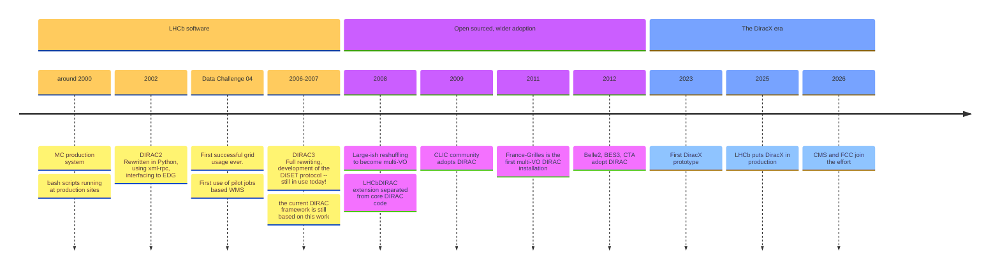

# The 12th Dirac(X) Users' Workshop
## Introduction to the workshop

**Federico Stagni** <Email v="federico.stagni@cern.ch" />

DiracGrid Technical Coordinator

 

13–16 October 2026, FZU Prague

<a href="https://indico.cern.ch/event/1588323/" class="ns-c-iconlink"><mdi-open-in-new />indico.cern.ch/event/1588323</a>

---
layout: top-title-two-cols
color: diracx-light
align: cm-lm-lm
title: welcome
columns: is-6
---

:: title::

# Welcome to the 12th DIRAC Users' Workshop

:: left ::

 
 
 

:: right :: 

- ... plus **2 "virtual" ones** that were held in COVID times.
- Great to see so many familiar faces here in Prague
  - and, equally, new ones.

---
layout: top-title
color: diracx-light
align: cm
title: rules
---

:: title::

# Workshop Rules

:: content ::

- The agenda has a **clear divide**: we *present in the mornings*, and we *discuss/hack in the afternoons* (in smaller groups)
- In general, there is **always** time for questions, but if they can be asked in the afternoons, **do ask them in the afternoons**
  - we often reserve topic sessions in the afternoons as continuation of the what is presented in the mornings
- We are here to **learn** from each other and **get things done**

---
layout: top-title
color: diracx-light
align: cm
title: DiracGrid
---

:: title::

# The shortened Dirac's story

:: content ::

Timeline:

(full history in [this presentation](https://indico.cern.ch/event/1252369/contributions/5515343/attachments/))

Nowadays, the DiracGrid project develops/maintains DIRAC, DiracX, Web, etc... (everything in https://github.com/DIRACGrid).

[diracgrid.org](https://diracgrid.org) is hosting "everything" else you need.

 

Also the **logos changed**: we moved from the DIRAC branding to the new **DiracX** identity.

  DIRAC
  →
   </img>

---
layout: top-title
color: diracx-light
align: cm
title: 2026-pivotal
---

:: title ::

# 2026 is a pivotal year

:: content ::

- **CMS and FCC are joining the effort** – bringing new requirements, scale, and energy to the project
- **New development process adopted** since the beginning of 2026
  - SCRUM-based, with 2-week sprints and regular checkpoint meetings
- **ADRs for everything** – Architecture Design Records guide every major decision before code is written
  - Transparent, reviewable, community-driven design process
  - [DX-ADR series](https://github.com/DIRACGrid/diracx/pulls?q=is%3Apr+is%3Aopen+label%3AADR) covers Transformation System, compute backends, CWL, and more

---
layout: top-title
color: diracx-light
align: cm
title: communication
---

:: title ::

# Communication

:: content ::

- We believe that proper communication is **paramount** to the success of the project
- We organize **4 in-person meetings per year**:
  - A 4-days workshop (somewhere, but **not at CERN**)
  - 3 2-days hackathons (**at CERN**)
- Every Thursday morning (at 10:00, at CERN) we meet:
  - `DDev`: the "SCRUM meeting" (Alexandre)
  - once every 4 weeks (mostly) proceeded by the `DOps` (a more operations and long-term developments oriented meeting)
- We should keep **everyone's requirements** in consideration

---
layout: top-title-two-cols
color: diracx-light
align: cm-lm-lm
title: releases
---

:: title ::

# Releases for DIRAC and DiracX stacks

:: left ::

**DIRAC v9**
- v8, v9.0, v9.1
- Regular releases continue
- [github.com/DIRACGrid/DIRAC/releases](https://github.com/DIRACGrid/DIRAC/releases)

**DiracX**
- Ongoing development releases
- [github.com/DIRACGrid/diracx/releases](https://github.com/DIRACGrid/diracx/releases)

 

`v8` and `v9.0` are in maintenance mode; new features go to `v9.1` and DiracX

:: right ::

<AdmonitionType type='note' >
This workshop is a lot about DiracX (the future is always brighter). We will definitely talk about DIRAC too, of course
</AdmonitionType>

---
layout: top-title
color: diracx-light
align: cm
title: v8-update
---

:: title ::

# Update process for v8 users

:: content ::

For v8 users still on the legacy stack:

- WRT one year ago, the only significant change is that **you should now target `v9.0`** (always target the latest tag in this branch), while from the `integration` branch we tag `v9.1` releases
  - [Wiki](https://github.com/DIRACGrid/DIRAC/wiki/DIRAC-9.0) for updating to `v9.0`
  - [Wiki](https://github.com/DIRACGrid/DIRAC/wiki/DIRAC-9.1) for updating to `v9.1`
- Contact the DiracGrid team (mostly me) if you need help with the transition

---
layout: top-title
color: diracx-light
align: cm
title: v8-update-deadline
---

:: title ::

# Talking about update...

:: content ::

What was in the presentation one year ago, at the 11th DUW:

 
 
 
 
 

...talk to us about this topic in the "Community Support" sessions these days.

---
layout: top-title
color: diracx-light
align: cm
title: hsf
---

:: title ::

# Publications, Outreach, and HSF

:: content ::

- CHEP 2026 papers on [DiracX in action](https://indico.cern.ch/event/1471803/contributions/6967106/) and [CWL](https://indico.cern.ch/event/1471803/contributions/6967104/)

**HSF Affiliated Project**
- DiracGrid is an [**HSF affiliated project**](https://hepsoftwarefoundation.org/projects/projects.html)
- Affiliation valid for 5 years (2025–2030), then reviewed for continuation

  

---
layout: top-title
color: diracx-light
align: cm
title: security
---

:: title ::

# How to provide us a security advisory

:: content ::

- Security is a priority for the DiracGrid project
- We use **GitHub Security Advisories** for private vulnerability reporting
- Report at:
  - [github.com/DIRACGrid/DIRAC/security](https://github.com/DIRACGrid/DIRAC/security)
  - [github.com/DIRACGrid/diracx/security](https://github.com/DIRACGrid/diracx/security)
- We will respond **ASAP**
- Supported versions: **>= v8.0** (older versions are not patched)

---
layout: top-title
color: diracx-light
align: cm
title: workshop-notes
---

:: title ::

# 2 Free-for-all notes for This Workshop

:: content ::

**Questions collection**
- If you want, note down the questions in https://codimd.web.cern.ch/gJTuQq0cS4ugVgyQnd9AgA
  - They will likely be answered in the "discussing and hacking" sessions

**Summaries**
- I will use https://codimd.web.cern.ch/xsfPlLVaRuiadX4hGUVmcw
- Volunteers are encouraged to add to the notes and share their understanding
- This helps everyone who couldn't attend and serves as a record for the community

Both the links are also linked from the workshop materials.

---
layout: section
color: diracx
title: Questions
---

# Questions?
